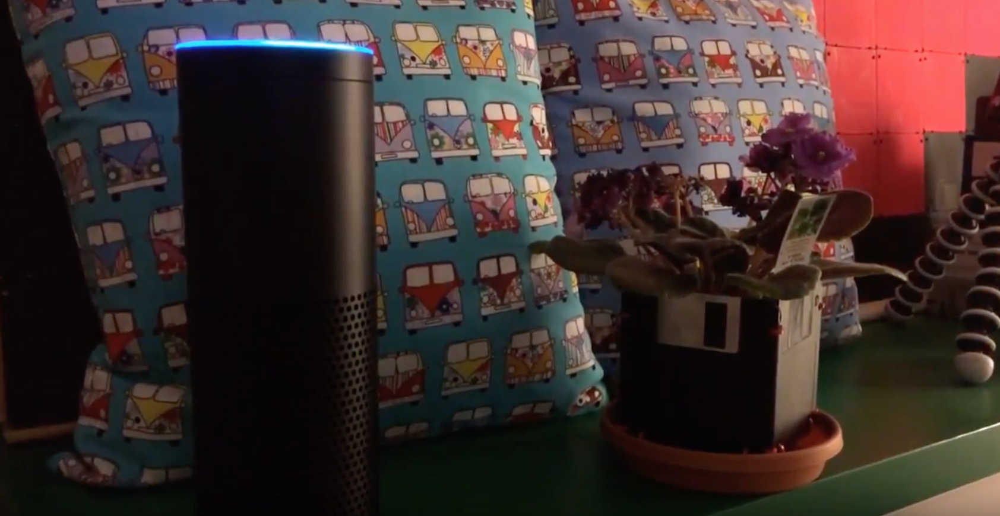

# Alexa BART

BART skill for Amazon Echo / Alexa in Python

There's a full blog post describing this and how it works on Medium.  Check it out [here](https://medium.com/modus-create-front-end-development/creating-an-interactive-voice-experience-with-amazon-alexa-2fed5d9b0e16#.sh0gqig4g).

# Demo Video

# Example Screenshots from Alexa App

### Initial Skill Welcome

### System Status Enquiry

### Elevator Status Enquiry

### Train Departures Enquiry

